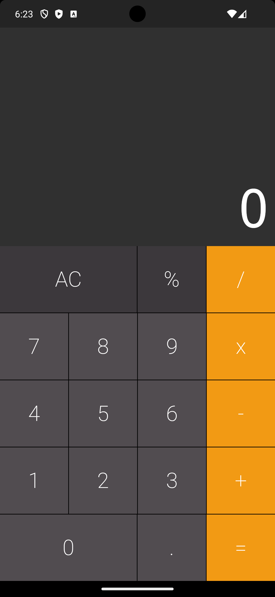

# Calculadora Flutter

Uma aplicação simples de calculadora desenvolvida em Flutter, compatível com Android e iOS, que realiza as quatro operações básicas: adição, subtração, multiplicação e divisão.

## Pacotes Utilizados

Este projeto utiliza o pacote `auto_size_text` para ajustar automaticamente o tamanho do texto com base no tamanho do widget pai. Isso é útil para garantir que os números e operadores sejam exibidos corretamente, independentemente do tamanho da tela do dispositivo.

Para mais informações sobre o pacote `auto_size_text`, consulte [aqui](https://pub.dev/packages/auto_size_text).

## Como Executar

Certifique-se de ter o Flutter SDK instalado em sua máquina. Para mais informações sobre como configurar o ambiente Flutter, consulte [aqui](https://flutter.dev/docs/get-started/install).

1. Clone este repositório:

```bash
git clone https://github.com/absjuniordev/Calculadora
```

2. Navegue até o diretório do projeto:

```bash
cd calculadora_flutter
```

3. Execute a aplicação:

```bash
flutter run
```

Isso irá iniciar a aplicação no dispositivo conectado ou no emulador.

## Funcionalidades

- Adição
- Subtração
- Multiplicação
- Divisão

## Capturas de Tela





## Contribuindo

Contribuições são bem-vindas! Se você encontrar um problema ou desejar adicionar uma nova funcionalidade, sinta-se à vontade para abrir uma issue ou enviar um pull request.

